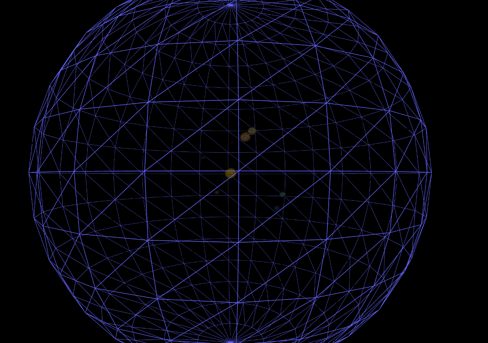

# SphereScape - Final Galaxy Zoom

This is a 3D solar system and galaxy visualization project built using [p5.js](https://p5js.org/). It displays the major planets of our solar system along with many small stars orbiting in a 3D space environment.

---

## Images

## Features

- 3D rendering using WebGL mode (`WEBGL`) with rotating planets and stars.
- Each planet has a unique distance, size, and color.
- Natural rotation and orbit animation for planets.
- A glowing central sun.
- A transparent wireframe sphere representing the outer galaxy.
- Smooth zoom-out effect slowly moving the whole scene backward.
- Planet names displayed above each planet, always facing the camera.
- Black background to simulate space.

---

## How to Use

1. Clone or download the repository.
2. Open the `index.html` file in a modern browser (Chrome or Firefox recommended).
3. Works offline since p5.js is loaded from CDN.

---

## Technical Details

- Language: JavaScript (using p5.js library)
- Rendering: WEBGL for 3D graphics.
- Animation: Positions of planets update every frame inside the `draw()` function.
- User Interface: No user interaction yet; this is a visual demo.

---

## Possible Improvements

- Show orbit paths for planets.
- Allow user to control camera movements.
- Add surface textures for planets.
- Add glow effect around the sun.

---
